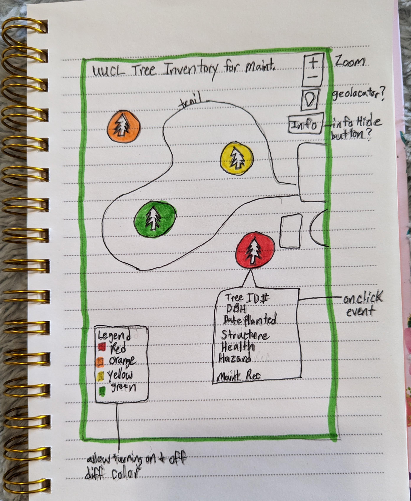

# trees4uucl
A repo for documenting the creation of a tree inventory on the property of UUCL Kentucky.

<!-- TOC -->

## Table of Contents
- [Part I. Project Summary Proposal ](#part-i-project-summary-proposal)  
- [Part II. Data Sources ](#part-ii-data-sources)  
    - [Basemap Data](#basemap-data)
    - [UUCL Tree Inventory Aug 2022](#uucl-tree-inventory-aug-2022)
- [Part III. Proposed Visuals](#part-iii-proposed-visuals)
- [Part IV. Objectives and User Needs](#part-iv-objectives-and-user-needs)
- [Part V. Data Processing Storage and Next Steps](#part-v-data-processing-storage-and-next-steps)
- [Part VI. Data Stack and JS Libraries to Employ](#part-vi-data-stack-and-js-libraries-to-employ)
- [Part VII. Layout](#part-vii-layout)
- [Inspiration](#inspiration)
- [References for readme](#references-for-readme)  
- [Final Map](#Final-Map)

<!-- /TOC -->

## Part I: Project Summary Proposal
Create two map types as requested:
1. One for utilization by Seven Acres Committee to monitor and maintain their tree inventory (interactive web map app).
2. A second for the utilization by general members and the public to walk the grounds and identify tree by common name (large poster board to print, mount or laminate and take on walks)

Interactive web map app is the priority currently as not all trees have been mapped yet and would be easier to update the data file for this map than it would the paper printed map which would necessitate mulitple printings of poster upon every update.

## Part II: Data Sources
### Basemap Data
Currently: OSM basemap  
Future: Add data from KYFromAbove and Dgi quadrant (recommended for clear imagery). Potential for adding via Rest Services.  

### UUCL Tree Inventory Aug 2022
UUCL 7 Acres Committee provided csv containing tree information from Tree Inventory performed on March 25- 26 & April 8 2022.   
Data file contains the following attributes:  
- Zone on property where tree exists
    1. Memorial Garden
    2. Woods
    3. Front Lawn
    4. Back Corner
- Tree ID# (unique for every tree identified)
- Cirumference (feet & inches)
- Diameter at Breast Height (DBH) (calculated by dividing circumference by 3.1415 to convert)
- Structure
    - Good
    - Moderate
    - Poor
- Health 
    - Good
    - Moderate
    - Declining
    - Dead
- Date of Planting
- Hazard/Safety Risk that may apply to tree
    - Deadlimbs
    - Standing Dead
    - Decay on Trunk
    - Dead tree/branches over trail
    - Parking underneath
- Maintenance Recommended
    - Cut Down
    - Cut Grape vines
    - Monitor Health
    - Remove Wire and POsts
    - Prune crossing/rubbing limbs
    - Mulch over roots
    - Monitor for Emerald Ash Borer (EAB)
- Any additional Notes

A kmz file was also provided with the points representing each tree and only it's corresponding ID # as 'Name' attribute.  
Upon adding csv file based on lat/long given, it aligns perfectly with the kmz file.  

## Part III. Proposed Visuals  
App Map Layer with color coded system for maintenance and priority of action  
    - SVG with tree in it colored accordingly (work in coolors for accessible colors for all vision abilities)
        - Black = high priority  
        - Brown = medium priority  
        - Light Green = low priority  
        - Dark Green = no reponse needed at this time  
Allow pin pointing user location to help them identify where on the property they are with respect to the trees.  Would need to confirm accuracy of geolocator if it would fulfill the zoom level necessary to prove useful.  

## Part IV. Objectives and User Needs  
Maintenance User Needs:   
    - Tree ID    
    - Health   
    - Maintenance Recommendations  
    - Hazard/Safety  
    - Use on mobile device  
Visitor User Needs:  
    - Tree ID   
    - Identify Differences Between Trees using Common Name   
    - Could later add photographs   
    - Could also add links to info about the types of trees from external resources (US Forestry or Ky Div of Forestry)  
    - Use on mobile device   
Objectives:   
    - Will need to be able to click through variety of different layers with drop down menu (or clickable legend)      
    - Will need to be able to click on point and access popup modal of information    
    - Will need to geolocate oneself in reference to the tree   
    - May or may not need to turn off and on an info box or legend box if covers screen   

## Part V. Data Processing, Storage, Next Steps  
Publish data from Google Sheet as CSV to web  
    - Allows for modification of a shared google sheet that auto updates map (only editable by those sheet is shared with)  
    - Any public entity looking at the code could download the data but could not modify or edit  
Add Googlesheet as delimited text layer to QGIS  
Transform into geojson in js  
Load geojson for vanilla js transformation    
Access single geojson, assign 'health' of trees to separate layers  
    - Good  
    - Moderate  
    - Declining  
    - Dead  
    - Unknown 
Add legend layer control to turn on and off specific tree type or structure/health/hazard  
Hosting on Github publicly? UUCL page publicly or behind log-in?  
Confirm projecting correctly NAD 83 (3089)  (to do)  
Add DGI aerial? Add to data sources and citations (clipped or rest services?)   
Add DGI tree layer or 3 d trees? Make a version in Felt?  
Refactor code where styling is external from html.  

## Part VI. Data Stack and JS Libraries to Employ  
html to host & leaflet js for interactivity:  
Leaflet js to access osm data for basemap, or kyabove for aerial data.  
Leaflet js to access [GeoJSON object](https://leafletjs.com/examples/geojson/)   
Leaflet js to control [groups & layers](https://leafletjs.com/examples/layers-control/)   
Leaflet js to access geolocation [leaflet on mobile example](https://leafletjs.com/examples/mobile/)   
 
## Part VII. Layout  
### Mockup WireFrame 1  

## Inspiration  
Health of Tree Inventory for 7 Acres Committee Use inspired by Illinois [Chapter Community Associtations Institute](https://www.cai-illinois.org/tree-inventory-community-benefits-seeing-forest-trees/).  
Past files to reflect upon:  
    - 672-2: marker locations? (hometowns)  
    - 672-3: beach vacations?  
    - 672-5: new orleans markers leaflet, mouseover popups, (stylized svgs)  
    - 672-6: intro to leaflet, draw svg, UK path after work, felines on your mind (could show trail in woods like this path) 
    - 672-7: proportion markers  
    - 672-8: wind solar plant, leaflet markes, layers/overlapping  
    - 672-9: median counties rent across usa, housing in ky, chloropleth map, drop down menu?  
    - Denver home hunting (using the legend to turn layers on and off)
    - Fragipan (on portfolio) What's in the pan final (where am i geolocator, points with tooltips (including pictures and links), hide info button, zoom in/out, accessing geojson to add layer)  
    - 673-3: Oregon unemployment rates by county, zoom rolling, legend, slider bar for year, visual affordance+click, tooltip)  

## References for readme  

## Final Map  
[Current Map](https://rcramsey.github.io/trees4uucl/)
Publish json and files following 672-10 final readme.md  (settings - change view private to public; Settings - Pages tab - select branch - save; add a metadata file publish.json like in 672-10.)